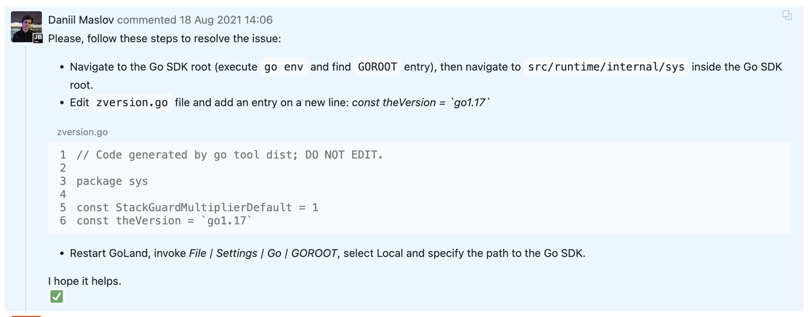

## 准备工作

在课程网站中推荐使用G1.15，但是在我的电脑上使用go的plugin功能时会出现无法加载，或者无法编译plugin的情况。

接着我看了下src/main/test-mr.sh这个文件，其中指明在macos系统上go1.17 before 1.17.6有时会出现崩溃情况。

因此我决定使用go1.18版本，经过测试一切正常。下面记录一下安装go1.18版本以及在`Goland`中配置`GROOT`所遇到的问题。

通过下述命令安装，注意需要使用到代理，这可以通过设置http和https环境变量解决。

```bash
go install golang.org/dl/go1.18@latest
go1.18 download
```

接着在路径`~/go/sdk`中可以看到安装的特定版本的`go`文件夹，命令行`go1.18 env GOROOT`可以看到路径。

接着在`Goland`中设置`GOROOT`出现错误，`The selected directory is not a valid home for Go SDK`，这是`Goland`的一个问题。

我参考了[这个讨论](https://youtrack.jetbrains.com/issue/GO-11588#focus=Comments-27-5127829.0-0) 中的方法解决了问题。



一切准备就绪，接下来可以进入MIT6.824课程实验正题了。

## MapReduce

```bash
cd src/main
go build -race -buildmode=plugin ../mrapps/wc.go
go run -race mrsequential.go wc.so pg*.txt
```
上述第二条命令是编译`wc.go`为共享库，在go语言中的表现形式是plugin。接着第三条命令加载它以MapReduce的方式运行代码获得结果。

本个lab的任务是通过test-mr.sh的测试，所以我要阅读一下其中的代码。在阅读代码过程中，我发现了这段：`> /dev/null 2>&1`。

其中第一个`> /dev/null`表示将命令的输出重定向到`/dev/null`，接着`2>&1`表示把标准错误与标准输出融合在一起，其中`&`表现后面的是文件描述符，
而非文件名。

在MacOS默认是没有timeout命令的，可以通过`brew install coreutils`来使用`gtimeout`命令。

补充说明一点关于`GO RPC`的知识点，在接收RPC并不是队列的形式，而是每接收一个请求，就`go`一个线程，因此不存在等待的问题，同时也需要注意多线程编程加锁同步。

记录一下在做这个Lab时遇到的问题以及解决思路。

- `Go`的`range`循环并没有提供修改原数组的方法，都是深复制的变量。如果要修改数组的元素，必须通过索引的方法循环遍历。
- 在将近结束时，`c.cntCompleteMap`仍然小于`c.nMap`，但是这不代表现在仍然有可以分配的任务，因为有些任务处于这在处理状态。
- 通过一个`None`变量表示没有任务可做，当`worker`收到这样的消息时，就短暂的`Sleep`，之后再请求。
- 每当安排一个任务之后，就使用一个`go`线程计时，但是注意在线程内超时之后要判断该任务的状态，如果已经完成了，那就什么都不要干。
- 在标记一个任务被完成时，要注意检查这个任务当前的状态，否次可能会因为掉队者问题，重复加`c.cntCompleteMap`。

这个项目中`MapReduce`的大体思路是，`worker`向`coordinator`申请任务，先做`map`任务，当所有`map`任务完成之后才可以做`reduce`任务。
`map`任务的结果通过哈希将其分配到固定数量(`nReduce`)的桶中，`reduce`任务处理对应桶中的信息。最后将多个`reduce`的输出结合到一起便完成了任务。

论文阅读笔记：https://spongecaptain.cool/post/paper/mapreduce/

